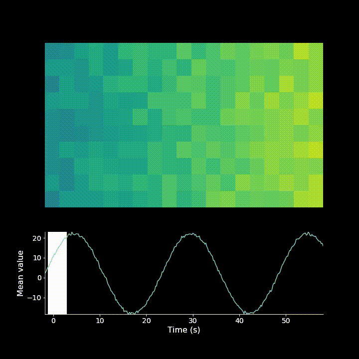

==============
Animate Images
==============

|Build Status| |PyPI version| |Updates| |Python3| |Cover|

Helper functions to make animations of images with corresponding traces and labels using matplotlib

-------------
Example uses:
-------------

If you have a 3d movie (time, x, y):

.. code-block:: python

    from Animate.Movie import Movie
    import numpy as np
    m = Movie(dt=1.0 / 14, height_ratio=1.5)
    img = np.random.randint(10, size=(40, 5, 5))
    m.add_image(img, style='dark_img')
    m.add_axis(x_label='time (s)', y_label='value')
    m.add_trace(img.mean(axis=(1, 2)))
    m.save('path/to/file/with_name', fps=1)

.. image:: resources/example.gif

If you have a 2d movie (x, y) where you want to have a sliding window movie:

.. code-block:: python

    import numpy as np
    from Animate.Movie import Movie

    # prepare data
    x_len = 300
    x_res = 20.0
    y_amplitude = 20
    noise_amplitude = 5
    x = np.arange(x_len) / x_res
    y = np.sin(x) * y_amplitude
    pix_number = 10
    img = np.random.randint(0, noise_amplitude, size=pix_number*x_len).reshape(pix_number, x_len) + y

    # make a movie
    rate = 5.0
    m = Movie(dt=1.0/rate)
    m.add_image(img, animation_type='window', window_size=19, window_step=5)
    m.add_axis('Time (s)', 'Mean value')
    m.add_trace(img.mean(axis=0))
    m.save('testing', fps=rate)

-------
Testing
-------

.. code-block:: bash

    pytest --pep8 --cov=Animate --cov-report html

---------
Deploying
---------

.. code-block:: bash

    bumpversion patch
    python setup.py sdist
    twine upload \dist\...

.. |Updates| image:: https://pyup.io/repos/github/boazmohar/AnimateImages/shield.svg
   :target: https://pyup.io/repos/github/boazmohar/AnimateImages/
.. |Python3| image:: https://pyup.io/repos/github/boazmohar/AnimateImages/python-3-shield.svg
   :target: https://pyup.io/repos/github/boazmohar/AnimateImages/
.. |Build Status| image:: https://travis-ci.org/boazmohar/AnimateImages.svg?branch=master
   :target: https://travis-ci.org/boazmohar/AnimateImages
.. |PyPI version| image:: https://badge.fury.io/py/animateimages.svg
   :target: https://badge.fury.io/py/animateimages
.. |Cover| image:: https://coveralls.io/repos/github/boazmohar/AnimateImages/badge.svg?branch=master?ts=1
   :target: https://coveralls.io/github/boazmohar/AnimateImages?branch=master
