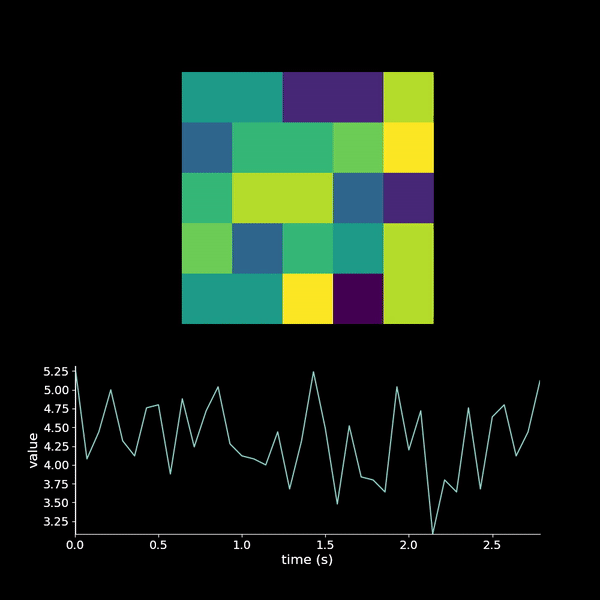

==============
Animate Images
==============

Helper functions to make animations of images with corresponding traces and labels using matplotlib

------------
Example use:
------------

.. code-block:: python

    from Animate.Movie import Movie
    import numpy as np
    m = Movie(dt=1.0 / 14, height_ratio=1.5)
    img = np.random.randint(10, size=(40, 5, 5))
    m.add_image(img, style='dark_img')
    m.add_axis(x_label='time (s)', y_label='value')
    m.add_trace(img.mean(axis=(1, 2)))
    m.save('path/to/file/with_name', fps=1)

-------
Testing
-------

.. code-block:: bash

    pytest --pep8 --cov=Animate --cov-report html

---------
Deploying
---------

.. code-block:: bash

    bumpversion patch
    python setup sdist
    twine upload \dist\...
